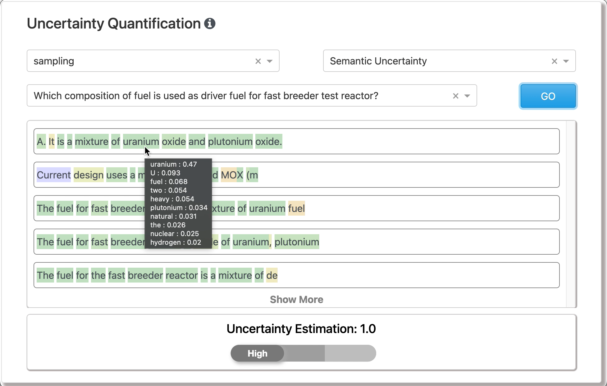

# EXPERT 2.0 Human-AI Reasoning Engine

[EXPERT 2.0](https://pnnl.gov/expert) develops novel AI foundation models to enable multi-hop reasoning over the scientific documents for generating human-interpretable evidence and uncertainty estimates.

</img>
 
</img>

## Table of Contents

* [Resources](#resources)
* [Publications](#publications)
* [Contributors](#contributors)
* [ATTRIBUTION](ATTRIBUTION)
* [LICENSE](LICENSE)
* [NOTICE](NOTICE)

## Resources

| Title | Description | Codebase |
| :---------------- | :------ | :----: |
| Model pretraining code for reasoning over multi-layer network representations | A pretrained model (not released publicly) and Jupyter notebooks with model pretraining and evaluation code to replicate the results. | [Source](model) |
| Novel Methodology for Human-In-the-Loop Evaluation | NuclearQA: A Human-made Benchmark for Language Models for the Nuclear Domain | [Source](benchmark) |
| Test and evaluation framework for AI reasoning | Prompt-based evaluation framework in a Jupyter notebook for AI reasoning | [Source](evaluation) |
| AI-powered Reasoning Engine and AI-based approaches for evidence generation with uncertainty quantification | Jupyter widgets with AI-based techniques for evidence generation and uncertainty quantification to support human-AI reasoning | [Source](reasoning) |

## Publications

Acharya, A., Munikoti, S., Hellinger, A.C., Smith, S., Wagle, S., & Horawalavithana, S. (2023). NuclearQA: A Human-made Benchmark for Language Models for the Nuclear Domain. arXiv preprint arXiv:2310.10920. https://arxiv.org/abs/2310.10920

Horawalavithana, S., Ayton, E., Usenko, A., Cosbey, R., & Volkova, S. (2023). Anticipating Technical Expertise and Capability Evolution in Research Communities using Dynamic Graph Transformers. arXiv preprint arXiv:2307.09665. https://arxiv.org/abs/2307.09665

## Contributors
- Sai Munikoti - sai.munikoti [at] pnnl [dot] gov
- Anurag Acharya - anurag.acharya [at] pnnl [dot] gov
- Sridevi Wagle - sridevi.wagle [at] pnnl [dot] gov
- Shivam Sharma - shivam.sharma [at] pnnl [dot] gov
- Danielle Briseno - danielle.briseno [at] pnnl [dot] gov
- Sara Smith (co-PI/PM) - sara.smith [at] pnnl [dot] gov
- Sameera Horawalavithana (PI) - yasanka.horawalavithana [at] pnnl [dot] gov

## Acknowledgments
This work was supported by the NNSA Office of Defense Nuclear Nonproliferation Research and Development, U.S. Department of Energy, and Pacific Northwest National Laboratory, which is operated by Battelle Memorial Institute for the U.S. Department of Energy under Contract DE-AC05–76RLO1830. This software repository has been cleared by PNNL for public release as PNNL-SA-191045.

_______________________________________________________________________________

This material was prepared as an account of work sponsored by an agency of the United States Government.  Neither the United States Government nor the United States Department of Energy, nor Battelle, nor any of their employees, nor any jurisdiction or organization that has cooperated in the development of these materials, makes any warranty, express or implied, or assumes any legal liability or responsibility for the accuracy, completeness, or usefulness or any information, apparatus, product, software, or process disclosed, or represents that its use would not infringe privately owned rights.
Reference herein to any specific commercial product, process, or service by trade name, trademark, manufacturer, or otherwise does not necessarily constitute or imply its endorsement, recommendation, or favoring by the United States Government or any agency thereof, or Battelle Memorial Institute. The views and opinions of authors expressed herein do not necessarily state or reflect those of the United States Government or any agency thereof.

PACIFIC NORTHWEST NATIONAL LABORATORY 
<i>operated by 
BATTELLE 
<i>for the 
UNITED STATES DEPARTMENT OF ENERGY 
<i>under Contract DE-AC05-76RL01830

