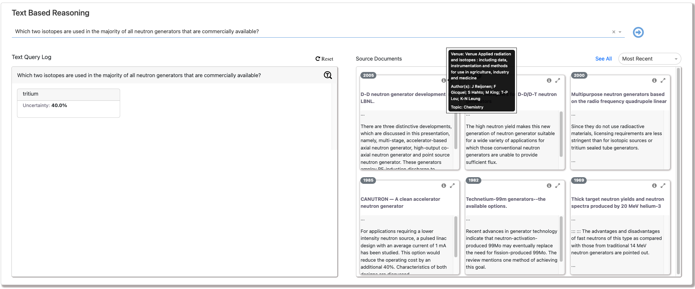

<!-- PROJECT LOGO -->
 

<!-- RESEASE NOTES -->
## Release Notes

  Release 0.2: This repository contains methods to demonstrate the reasoning widget. This panel is currently under development and will include the textual reasoning queries that can be answered from EXPERT context graphs.

## Introduction

  This widget demonstrates the capabilities of reasoning with evidence. The tool showcases open domain question answering with passage retrieval. The answer to user - selected question is displayed along with the uncertainty score. The most relevant passages supporting the answer are displayed as part of the query result with access to full text of the corresponding passages. Apart from the results, the widget also provides details on demand displaying meta data of the paper like authors, venue and topic. By default, the results display top six most relevant passages. User can view more results by selecting 'See All' option and the results can be sorted by data using the sort dropdown. 

<!-- USAGE EXAMPLES -->
## Usage

<a href="reasoning_widget.ipynb">View Demo</a>

##### Inital state of reasoning widget:
</img>
  

##### Text query results displayed after user selects the question:
</img>
  

##### Details on demand: Additional information on the full text can be seen after user hovers on the 'info' icon:
</img>
  

##### Displays full text of the corresponding evidences:
</img>
  

##### Graph Based Reasoning Output:
</img>