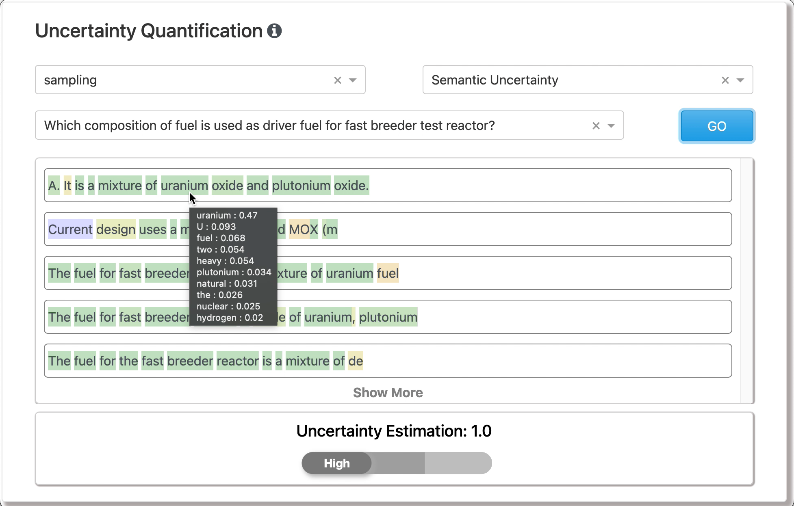

<!-- PROJECT LOGO -->
 

<!-- RESEASE NOTES -->
## Release Notes

  Release 0.1: This repository contains methods of estimating uncertainty of autoregressive Large Language Models (LLM) and demonstration using Jupyter widgets.

<!-- USAGE EXAMPLES -->
## Usage

<a href="./docs/UQ_pipeline.ipynb">View Demo</a>
</img>
</img>

<!-- ROADMAP -->
## Roadmap

- [x] Extract LLM Token Generation Probabilities
- [x] Measuring Uncertainty in the Generated Sequences
    - [x] Entropy
    - [x] Normalized Entropy
    - [x] Lexical Entropy
    - [x] Semantic Entropy